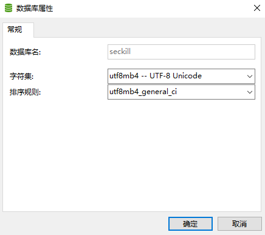
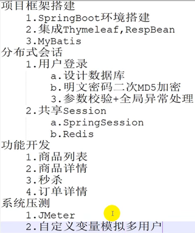
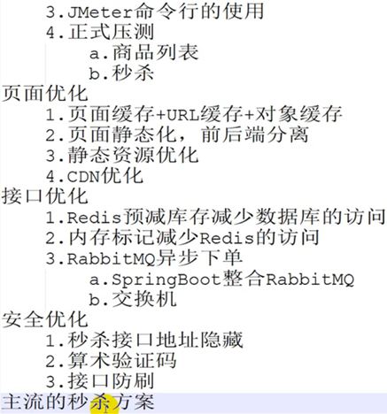

# secondkill 秒杀系统
## 1、数据库建表
### ①直接运行项目中的seckill.sql文件
### ②运行下面的语句(一共五个表)
#### 首先建立一个数据库

#### 创建商品表
```
CREATE TABLE `t_goods` (
  `id` bigint(20) NOT NULL AUTO_INCREMENT COMMENT '商品ID',
  `goods_name` varchar(16) DEFAULT NULL COMMENT '商品名称',
  `goods_title` varchar(64) DEFAULT NULL COMMENT '商品标题',
  `goods_img` varchar(64) DEFAULT NULL COMMENT '商品图片',
  `goods_detail` longtext COMMENT '商品详情',
  `goods_price` decimal(10,2) DEFAULT '0.00' COMMENT '商品价格',
  `goods_stock` int(11) DEFAULT '0' COMMENT '商品库存,-1表示没有限制',
  PRIMARY KEY (`id`)
) ENGINE=InnoDB AUTO_INCREMENT=3 DEFAULT CHARSET=utf8mb4;
```
#### 创建订单表
```
CREATE TABLE `t_order` (
  `id` bigint(20) NOT NULL AUTO_INCREMENT COMMENT '订单ID',
  `user_id` bigint(20) DEFAULT NULL COMMENT '用户ID',
  `goods_id` bigint(20) DEFAULT NULL COMMENT '商品ID',
  `delivery_addr_id` bigint(20) DEFAULT NULL COMMENT '收货地址ID',
  `goods_name` varchar(16) DEFAULT NULL COMMENT '冗余过来的商品名称',
  `goods_count` int(11) DEFAULT '0' COMMENT '商品数量',
  `goods_price` decimal(10,2) DEFAULT '0.00' COMMENT '商品单价',
  `order_channel` tinyint(4) DEFAULT '0' COMMENT '1pc,2android,3ios',
  `status` tinyint(4) DEFAULT '0' COMMENT '订单状态，0新建未支付，1已支付，2已发货，3已收货，4已退款，5已完成',
  `create_date` datetime DEFAULT NULL COMMENT '订单的创建时间',
  `pay_date` datetime DEFAULT NULL COMMENT '支付时间',
  PRIMARY KEY (`id`)
) ENGINE=InnoDB AUTO_INCREMENT=5687 DEFAULT CHARSET=utf8mb4;
```
#### 创建秒杀商品表
```
CREATE TABLE `t_seckill_goods` (
  `id` bigint(20) NOT NULL AUTO_INCREMENT COMMENT '秒杀商品ID',
  `goods_id` bigint(20) DEFAULT NULL COMMENT '商品ID',
  `seckill_price` decimal(10,2) DEFAULT '0.00' COMMENT '秒杀价',
  `stock_count` int(10) DEFAULT NULL COMMENT '库存数量',
  `start_date` datetime DEFAULT NULL COMMENT '秒杀开始时间',
  `end_date` datetime DEFAULT NULL COMMENT '秒杀结束时间',
  PRIMARY KEY (`id`)
) ENGINE=InnoDB AUTO_INCREMENT=3 DEFAULT CHARSET=utf8mb4;
```
#### 创建秒杀订单表
```
CREATE TABLE `t_seckill_order` (
  `id` bigint(20) NOT NULL AUTO_INCREMENT COMMENT '秒杀订单ID',
  `user_id` bigint(20) DEFAULT NULL COMMENT '用户ID',
  `order_id` bigint(20) DEFAULT NULL COMMENT '订单ID',
  `goods_id` bigint(20) DEFAULT NULL COMMENT '商品ID',
  PRIMARY KEY (`id`),
  UNIQUE KEY `seckill_uid_gid` (`user_id`,`goods_id`) USING BTREE COMMENT '用户id+商品id解决同一个用户秒杀多商品'
) ENGINE=InnoDB AUTO_INCREMENT=5687 DEFAULT CHARSET=utf8mb4;
```
#### 创建用户表
```
CREATE TABLE `t_user` (
  `id` bigint(20) NOT NULL COMMENT '用户ID,手机号码',
  `nickname` varchar(255) NOT NULL,
  `password` varchar(32) DEFAULT NULL COMMENT 'MD5(MD5(pass明文+固定salt)+salt)',
  `slat` varchar(10) DEFAULT NULL,
  `head` varchar(128) DEFAULT NULL COMMENT '头像',
  `register_date` datetime DEFAULT NULL COMMENT '注册时间',
  `last_login_date` datetime DEFAULT NULL COMMENT '最后一次登陆时间',
  `login_count` int(11) DEFAULT '0' COMMENT '登陆次数',
  PRIMARY KEY (`id`)
) ENGINE=InnoDB DEFAULT CHARSET=utf8mb4;
```
## 2、还需要安装的东西
### Redis（缓存中间件）
### RabbitMQ（消息队列）
### Jmter（压测工具，文件中已有）
## 3、启动项目
### 项目服务器地址是127.0.0.1
### 登陆网页地址：localhost:8080/login/toLogin

## 4、项目架构



## 5、自述学习总结
### 学习地址为b站：https://www.bilibili.com/video/BV1sf4y1L7KE?p=1
### 参考文档为:Java秒杀方案.pdf
### 前端优化
#### ①一开始是将整个页面缓存在了redis中，加快响应速度。后面设计了静态页面，在本这个项目中，也就是只用了ajax来发送请求、传输数据等。用户不用每次都要去请求整个页面，降低了服务器的压力。
#### ②在秒杀开始的时候才显示秒杀按钮。

### 后端优化
#### ①在项目启动的时候，就把mysql中的秒杀商品库存加载到redis中。后续的减库存直接在redis中进行。使用redis的自减命令有效的防止了超卖问题（后面用了lua脚本来预减库存）。
#### ②在mysql中将秒杀订单表中的商品id和用户id设置为唯一索引，在数据库端保证一个用户只能秒杀一件商品。
#### ③用户在有了一个订单之后，存入redis中，加快响应速度。
#### ④下订单的操作交给了RabbitMQ来做，有效的降低了服务器的压力。
#### ⑤设置了一个内存标记。当redis中的库存为0之后，不用访问redis，直接返回。
#### ⑥明文密码二次加密。第一次加密是为了防止密码在网络中明文传输。第二次加密是为了防止服务器被攻击而采取的保护措施。
### 安全优化
#### ①为了防止脚本刷接口，做了算术验证码进行校验。这样做可以阻止一部分简单脚本，一方面可以延长时间跨度。
#### ②为了更好的防止一些较为高级一点的脚本，隐藏了秒杀接口地址。在秒杀的时候，需要先根据用户id和商品id获取秒杀地址，然后再去请求秒杀接口。这样可以阻止一些高级的秒杀脚本。
#### ③使用redis进行计数限流。设置每秒钟只能有50个请求打进来。对于不同的秒杀商品，使用了AOP注解进行不用的技术限流。然后顺便把每个接口的参数User存进了线程的ThreadLocal中进行保存和获取。